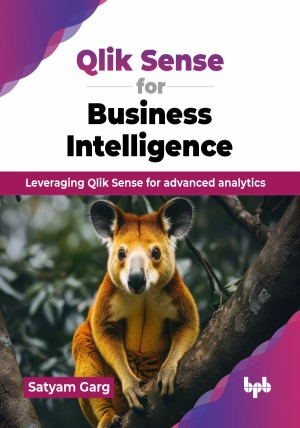

# Qlik Sense for Business Intelligence

Leveraging Qlik Sense for advanced analytics.

This is the repository for [Qlik Sense for Business Intelligence
](https://bpbonline.com/products/qlik-sense-for-business-intelligence),published by BPB Publications.

## About the Book
Qlik Sense is a powerful business intelligence tool that helps organizations make data-driven decisions. It is widely used by businesses of all sizes to visualize and analyze data to gain insights into their operations.

This book is a detailed guide to Qlik Sense, a top business intelligence tool. It covers BI basics, data modeling, visualization, and advanced analysis techniques. Learn to create dashboards, explore data associations, and share insights through stories and annotations. The book also offers guidance on managing and securing your Qlik Sense environment, with tips on troubleshooting and backups, ensuring effective use for data-driven decisions. 

By the end of the book, readers will have a deep understanding of Qlik Sense and the ability to use it to solve complex business problems. Readers will learn how to use data visualization and analytics to make informed business decisions, as well as how to build effective data models and create data stories that communicate insights effectively. 

## What You Will Learn
• Master Qlik Sense architecture, environment setup, and application creation.

• Create advanced data visualizations with interactive charts and dashboards.

• Implement efficient data modeling, optimization, and performance tuning.

• Build NPrinting reports and mashups for enhanced data reporting.

• Manage user access, security, and governance for Qlik Sense environments.

